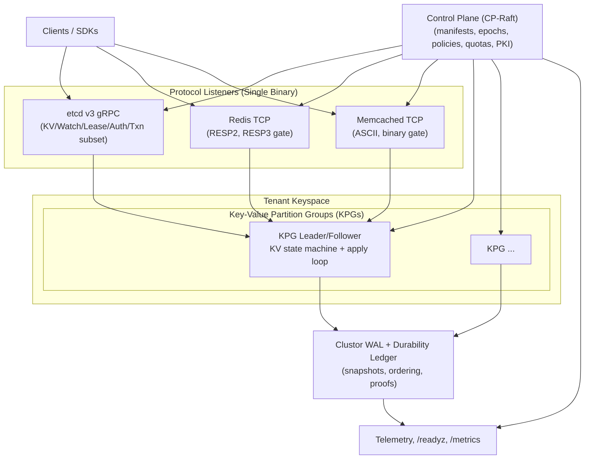

# Lattice – Raft-Backed Multi-Protocol Key-Value Overlay

Lattice is a single-binary, multi-protocol **distributed key-value store** that layers etcd v3, Redis, and Memcached client semantics on top of the Clustor Raft consensus core. Each tenant is sharded into Key-Value Partition Groups (KPGs) that host the same KV state machine, while ControlPlaneRaft (CP-Raft) stores tenant manifests, routing epochs, adapter policies, quotas, and PKI material. Lattice inherits Clustor’s ordering, durability ledgers, strict fallback behavior, read gates, snapshot model, and security guardrails (Clustor spec §§3–14) and constrains every adapter to the same durability and determinism rules.

---

## Why Lattice
- **Three protocol surfaces, one state machine** – etcd v3 (gRPC), Redis (RESP2/RESP3 gated), and Memcached (ASCII / optional binary) map into a single KV primitive set with a shared revision contract and deterministic TTL.
- **LIN-BOUND (fail-closed linearizability)** – Lattice MUST NOT claim linearizable semantics unless the Clustor leader can serve ReadIndex and the response is fenced by the same proof and index equality. When LIN-BOUND is not satisfied, linearizable operations fail closed with protocol-specific errors; snapshot-only reads are offered only where explicitly allowed.
- **KVSOURCE durability invariant** – every observable KV effect derives exclusively from WAL entries or signed snapshots; adapters cannot introduce alternate durable channels.
- **Operational determinism** – strict fallback and CP cache freshness semantics are inherited from Clustor; stale/expired control-plane caches force LIN-BOUND failure and stricter policy enforcement.
- **Multi-tenant isolation + quotas** – tenant namespaces, routing epochs, command allowlists, and token buckets are controlled in CP-Raft and enforced uniformly across adapters.

---

## Architecture Overview



- **Protocol listeners** translate wire semantics into a unified KV primitive set and route requests by tenant + key hash and the active `kv_epoch`.
- **KPG runtime** applies mutations in WAL order, enforces deterministic TTL via committed ticks, emits snapshots, and exposes adapter-facing request routing and read fences.
- **CP cache agent** watches CP-Raft for manifests and policy, enforces cache state semantics (Fresh/Cached/Stale/Expired), and couples stale control-plane state to strict fallback and LIN-BOUND behavior.

---

## Routing & Sharding

Keys are tenant-scoped byte strings. Routing is versioned and fenced by `kv_epoch`:

- Single-key routing:
  - `kpg = hash64(tenant_id, key_bytes, hash_seed_version) % tenant_kpg_count`
- Range operations:
  - **Single-KPG ranges** are supported directly.
  - **Multi-KPG ranges** require CP-Raft approved fanout plans and are exposed only where adapter semantics tolerate partial fences.
- Epoch fencing:
  - Any request carrying an older `kv_epoch` MUST be rejected as `dirty_epoch` (adapter mapping in “Errors”).

Within a KPG, revisions are totally ordered by WAL; across KPGs there is no total order and adapters MUST NOT claim global ordering unless restricted to a single KPG.

---

## Data Model & Revision Semantics

Each KPG hosts the same state machine:

- KV record:
  - `Key → ValueState{value_bytes, create_revision, mod_revision, version, lease_id?, expiry_at_ms?, metadata_flags}`
- Lease record:
  - `LeaseID → LeaseState{ttl_ms, granted_at_ms, keepalive_deadline_ms, attached_keys[], epoch}`
- Durable watch state (required for replay correctness):
  - `WatchID → WatchState{key_range, start_revision, filters, progress_notify, last_sent_revision}`

Revisions:
- `revision` is monotone per KPG.
- For mutations, `mod_revision` equals the Raft log index that performed the mutation.
- For read fences, responses may return a `header.revision` that equals the commit index used to fence the read and may exceed any `mod_revision` in the payload.

---

## LIN-BOUND and Read Semantics

Define:
- `can_linearize = clustor_read_gate_predicate() == true` (leader only).
- `can_snapshot_read = true` only when Clustor permits snapshot reads for the serving role.

LIN-BOUND gates:
1. Linearizable reads
2. Compare/CAS evaluation
3. Transaction fences

LIN-BOUND does **not** gate non-conditional writes; writes follow Clustor durability rules and may be forced stricter under strict fallback.

Service matrix:

| Operation class | Healthy (ReadIndex eligible) | Strict fallback / ReadIndex ineligible |
| --- | --- | --- |
| Linearizable reads / compare / txn fences | Allowed | MUST fail closed (adapter-specific) |
| Snapshot-only reads (explicitly permitted) | Allowed | Allowed, with adapter-visible limitations |
| Non-conditional writes | Allowed (configured durability) | Allowed under Clustor rules (durability may be forced strict) |
| Watches (start at “now”) | Allowed | MUST fail closed or start snapshot-only with explicit flags |

---

## Deterministic TTL and Time

TTL behavior is deterministic and replayable:

- A committed tick source (`Tick(ms)`) is written periodically to WAL (default 1s) or derived from a snapshot manifest time fence when enabled by feature gate.
- Expiration is evaluated only when processing a committed tick or when a mutation touches the key.
- Lease keepalives are WAL-backed mutations and follow Clustor durability ACK rules.

---

## Protocol Surfaces

### etcd v3 Adapter (subset)

- **Transport:** etcd v3-compatible gRPC endpoint with mTLS required. AuthN/Z derived from CP-Raft principal manifests.
- **Range (Get):**
  - `serializable=false` is **linearizable** and requires `can_linearize=true` with a ReadIndex fence.
  - `serializable=true` maps to **snapshot-only** semantics; per-session monotonicity is best-effort only and not guaranteed.
  - Linearizable multi-KPG ranges are rejected by default in v0.1 unless CP-Raft provides a fanout plan with a single fence mechanism.
- **Put/Delete:** quorum-durable before success. `prev_kv` computed in apply loop.
- **Txn:** single revision fence in apply loop; compares supported: `mod_revision`, `create_revision`, `version`, `value`, `lease`.
  - Cross-shard Txn is rejected in v0.1 with `TxnCrossShardUnsupported` unless a CP feature gate provides deterministic coordination (out of scope).
  - Under LIN-BOUND failure: fail closed with `UNAVAILABLE` + `LinearizabilityUnavailable`.
- **Watch:**
  - `start_revision=0` requires `can_linearize=true` or must reject / downgrade to snapshot-only with a protocol-visible flag (`watch_semantics=SNAPSHOT_ONLY` via custom trailer).
  - Delivery order: per-key by `mod_revision`, per-watch by WAL order within the KPG.
- **Lease:** grant/revoke/keepalive are WAL-backed; expiry uses deterministic ticks.
- **Auth:** minimal subset (principal auth, prefix RBAC, token TTLs); stale/expired CP cache forces fail-closed policy evaluation.

### Redis Adapter (subset)

- **Protocol:** RESP2 by default; RESP3 gated by CP-Raft feature flag. TLS supported; mTLS required in production profiles.
- **Data types:** Strings, Hashes, TTL metadata.
- **Supported commands (normative subset):**
  - Strings: `GET`, `SET` (`NX/XX`, `EX/PX`), `MGET` (single-KPG default), `INCR/DECR` (single key).
  - TTL: `EXPIRE`, `PEXPIRE`, `TTL`, `PTTL`.
  - Hashes: `HGET`, `HSET`, `HDEL`, `HMGET` (single-KPG).
  - Admin-lite: `PING`, `INFO` (restricted), `AUTH` (optional; CP-mapped).
- **Linearizable vs snapshot-only:**
  - Commands that must be linearizable to match expectations (`GET` after an acknowledged `SET` on a stable route, conditional `SET NX/XX`, `INCR/DECR`) require `can_linearize=true` or fail closed with `-TRYAGAIN linearizability unavailable`.
  - Snapshot-only allowances (e.g., `TTL/PTTL`) are configuration-gated and must be labeled in telemetry and reflected in `INFO`.
- **MULTI/EXEC:**
  - Supported only when all queued commands target a single KPG.
  - Under LIN-BOUND failure: `EXEC` fails closed with `-TRYAGAIN linearizability unavailable`.
  - `WATCH` is not supported in v0.1.
- **Scripting:**
  - `EVAL/EVALSHA` disabled in v0.1 unless a feature gate ensures determinism and bounded execution.

### Memcached Adapter (subset)

- **Protocol:** ASCII supported; binary gated by feature flag. UDP optional and disabled by default in production profiles.
- **Supported commands:** `get`, `gets`, `set`, `add`, `replace`, `append`, `prepend`, `delete`, `incr`, `decr`, `touch`, `cas`.
- **CAS semantics:**
  - `gets` returns CAS token equal to the key’s current `mod_revision` (unsigned 64-bit).
  - `cas` succeeds only if current `mod_revision` equals provided token, evaluated at a linearizable fence.
  - Under LIN-BOUND failure: `cas` fails closed with `SERVER_ERROR linearizability unavailable`.
  - CAS token monotonicity is per-key only; tokens are not globally ordered.
- **Expiration:**
  - Expirations map to deterministic ticks; absolute expiry times are converted to deadlines but applied only in tick processing.
  - TTL bounds are enforced (clamp or reject consistently per deployment).

---

## Errors and Protocol Mapping

Common conditions:
- `dirty_epoch` – request references older `kv_epoch` or routes to the wrong KPG.
- `LinearizabilityUnavailable` – LIN-BOUND failure due to read gate failure, strict fallback, or CP cache staleness/expiry.
- `ThrottleEnvelope` – backpressure from Clustor flow control or tenant quotas.

Normative adapter mappings:
- **etcd v3**
  - `dirty_epoch` → gRPC `FAILED_PRECONDITION` + `{expected_epoch, observed_epoch}`
  - `LinearizabilityUnavailable` → gRPC `UNAVAILABLE` + `{reason: ControlPlaneUnavailable|StrictFallback|ProofMismatch}`
  - `TxnCrossShardUnsupported` → gRPC `FAILED_PRECONDITION` + `{reason: "TxnCrossShardUnsupported"}`
- **Redis**
  - `dirty_epoch` → `-TRYAGAIN routing epoch changed` (no `-MOVED`)
  - `LinearizabilityUnavailable` → `-TRYAGAIN linearizability unavailable`
- **Memcached**
  - `dirty_epoch` → `SERVER_ERROR routing epoch changed`
  - `LinearizabilityUnavailable` → `SERVER_ERROR linearizability unavailable`

---

## Control Plane (CP-Raft)

CP-Raft is authoritative for:
- Tenant manifests: KPG count, routing epoch, hash seed version, adapter enablement, command allowlists, TTL bounds.
- Quotas: per-tenant token buckets for requests/bytes.
- PKI and RBAC: tenant identities, cert bundles, role policies, break-glass override policy (inherited from Clustor).
- Feature gates: RESP3, Memcached binary protocol, scan support, scripting, multi-KPG fanout plans, future cross-shard Txn mechanisms.

Cache semantics follow Clustor’s Fresh/Cached/Stale/Expired matrix. Any transition to Stale/Expired forces strict fallback, causes LIN-BOUND failure for linearizable operations, and revokes follower-read and watch-start linearization guarantees.

---

## Observability & Operations

Metrics namespaces:
- `lattice.kv.*`
- `lattice.adapter.etcd.*`
- `lattice.adapter.redis.*`
- `lattice.adapter.memcached.*`
- `lattice.quota.*`
- plus inherited `clustor.*`

Required telemetry fields include:
- `lin_bound.can_linearize`, `lin_bound.failed_clause`, `read_gate.*`
- `kv.revision`, `kv.compaction_floor_revision`
- `ttl.expiry_queue_depth`, `watch.active_streams`, `lease.active_leases`
- `adapter.<name>.requests_total`, `adapter.<name>.errors_total`
- `quota.throttle_total`, `dirty_epoch_total`

Readiness:
- `/readyz` includes tenant routing epoch cache age, adapter enablement states, and a digest of the active manifest used for routing.

---

## Build, Tests, and Spec Sync

- The repository is expected to produce a **single binary** that embeds listeners and the CP cache agent; listeners are configuration-toggleable rather than separate daemons.
- Test code should live under `tests/` (integration) and tooling should be separate from main sources to keep release builds free of dead test code.
- Conformance suites (recommended, non-normative) should cover:
  - etcd linearizable get/put/txn/watch/lease behavior under healthy and strict fallback conditions
  - Redis command subset, pipelining order, single-KPG MULTI/EXEC constraints, deterministic TTL
  - Memcached CAS token mapping, expiry behavior, and strict fallback failure mapping
- Fault injection scenarios should include: CP cache stale/expired transitions, leader changes, disk latency spikes, snapshot import under load, routing epoch flips, and quota throttling.

---

## Repository Layout

| Directory | Type | Description |
|-----------|------|-------------|
| `src/` | Rust crate | Main library and single-binary entrypoint. Modules for KPG runtime, adapters (etcd/Redis/Memcached), routing, CP cache agent, quotas, and telemetry. |
| `tests/` | Integration tests | Adapter and state-machine integration tests, plus fault-injection harnesses. |
| `config/` | Assets | Example configuration profiles with per-listener enablement and durability mode defaults. |
| `docs/` | Documentation | Normative spec (`docs/specification.md`), operational guides, conformance notes, and runbooks. |
| `tools/` | Utilities | CI/dev tools for spec linting, fixture generation, telemetry validation, and chaos scenarios. |
| `telemetry/` | Assets | Telemetry catalog definitions and dashboards/alerts (not a crate). |
| `wire/` | Assets | Protocol surface notes, allowlists, and compatibility matrices (not a crate). |
| `certs/` | Assets | Development TLS material (not committed for production). |
| `data/` | Runtime | WAL segments, snapshots, and fixture seeds (gitignored except deterministic fixture seeds). |

---

## Documentation Pointers

- **Normative specification** – `docs/specification.md` is the authority for adapter mappings, LIN-BOUND, revision semantics, deterministic time/TTL, routing epochs, and failure behavior. README content is descriptive and must not be treated as normative.
- **Operations & HA** – `docs/deployment.md` and `docs/high_availability.md` describe readiness gates, strict fallback behavior, drain orchestration, and rolling upgrade guidance.
- **Performance & sizing** – `docs/performance.md` maps L1 server-side latency targets (≤10 ms p99 in-AZ from ingress receipt to WAL quorum durability for single-key writes under healthy conditions) to metrics and alerts.
- **Conformance** – `docs/interop.md` captures adapter compatibility limits and test suites; it must include explicit failure expectations under LIN-BOUND.

Lattice inherits Clustor's guardrails for consensus, durability, snapshots, read gates, strict fallback, and security. Keep CP manifests and routing epochs authoritative, treat LIN-BOUND failures as correctness signals (not transient noise), and ensure every adapter surface remains a pure translation layer over the single KV state machine.

---

## Quick Start

### Build

```bash
# Clone and build
cd lattice
make build

# Run tests
make test

# Check linting
make lint
```

### Development Mode

```bash
# Initialize development environment
lattice init --dev

# Start with example config
lattice start --config config/lattice.toml
```

### Production Deployment

See [Deployment Guide](docs/deployment.md) for full instructions.

```bash
# Build release binary
make build-release

# Start with production config
lattice start --config /etc/lattice/lattice.toml
```

---

## Implementation Status

### v0.1.0 Feature Checklist

#### Core Infrastructure
- [x] Configuration parsing and validation
- [x] Deterministic time (Tick) utilities
- [x] Runtime lifecycle management
- [x] Error types with adapter mapping

#### Control Plane Integration
- [x] CP-Raft API types
- [x] Cache agent with freshness semantics
- [x] Routing table and epoch validation
- [x] Capability and feature gate registry
- [x] Placement tracking

#### KPG Runtime
- [x] KV state machine (MVCC)
- [x] Apply loop with CAS-FENCE
- [x] Revision utilities
- [x] Lease management
- [x] Watch stream state
- [x] Idempotency support

#### LIN-BOUND Semantics
- [x] can_linearize predicate
- [x] ReadIndex fencing
- [x] Fail-closed behavior
- [x] Strict fallback coupling

#### Deterministic TTL
- [x] Tick WAL entries
- [x] Key expiration evaluation
- [x] Lease deadline enforcement
- [x] Expiration queue

#### etcd v3 Adapter
- [x] gRPC service setup
- [x] Range (Get) - linearizable and serializable
- [x] Put/Delete operations
- [x] Transactions (single-KPG)
- [x] Watch streams
- [x] Lease lifecycle
- [x] Auth (minimal subset)

#### Networking
- [x] TLS/mTLS configuration
- [x] Security manager
- [x] gRPC listener
- [x] Backpressure integration

#### Operations
- [x] Version gates and feature flags
- [x] Metrics registry (Prometheus format)
- [x] Health and readiness probes
- [x] Telemetry (structured logging)
- [x] Audit logging
- [x] Disaster recovery support

#### CLI
- [x] Argument parsing
- [x] Start/init/inspect commands
- [x] Snapshot export/import
- [x] Version information

### Not Implemented (Future)

- [ ] Redis adapter (RESP2/RESP3)
- [ ] Memcached adapter (ASCII/binary)
- [ ] Cross-KPG transactions
- [ ] Cross-KPG linearizable ranges
- [ ] Election/Lock services
- [ ] Lua scripting

---

## Testing

```bash
# Run all tests
make test

# Run specific test file
cargo test --test adapters

# Run conformance tests
make interop

# Run with verbose output
cargo test -- --nocapture
```

### Test Coverage

| Component | Tests |
|-----------|-------|
| Unit tests (lib) | 140 |
| Adapter tests | 38 |
| Control plane tests | 6 |
| Core tests | 58 |
| KPG tests | 54 |
| Interop tests | 63 |
| Network tests | 108 |
| Ops tests | 49 |
| Integration tests | 77 |

---

## Contributing

1. Fork the repository
2. Create a feature branch
3. Run `make lint` and `make test`
4. Submit a pull request

See [CONTRIBUTING.md](CONTRIBUTING.md) for guidelines.
