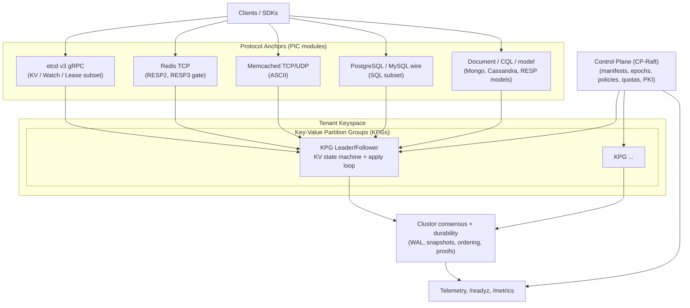

# Lattice — Raft-Backed Multi-Protocol Data Store

Lattice is a multi-protocol **distributed data store**, built as a set of
fluxor PIC modules, that layers familiar client protocols on top of the
Clustor Raft consensus core. There is no standalone binary: a node is a
`fluxor run` over a graph config in [`configs/`](configs/). Each tenant is
sharded into Key-Value Partition Groups (KPGs) that host the same KV state
machine, while ControlPlaneRaft (CP-Raft) stores tenant manifests, routing
epochs, adapter policies, quotas, and PKI material. Lattice inherits
Clustor's ordering, durability ledgers, strict fallback, read gates, snapshot
model, and security guardrails (Clustor spec §§3–14), and constrains every
adapter to the same durability and determinism rules.

The normative contract — adapter mappings, LIN-BOUND, revision semantics,
deterministic TTL, routing epochs, error mappings — is
[`docs/specification.md`](docs/specification.md). This README is descriptive;
where the two differ, the specification wins.

---

## Why Lattice

- **Many protocol surfaces, one state machine** — key-value protocols (etcd
  v3 gRPC, Redis RESP, Memcached ASCII) and data-model protocols (PostgreSQL
  and MySQL wire SQL, MongoDB documents, Cassandra CQL, and RESP-based graph /
  search / vector / time-series) all map onto the same KV primitive set with a
  shared revision contract and deterministic TTL.
- **LIN-BOUND (fail-closed linearizability)** — Lattice never claims
  linearizable semantics unless the Clustor leader can serve ReadIndex and the
  response is fenced by the same proof and index equality. When LIN-BOUND is
  not satisfied, linearizable operations fail closed with protocol-specific
  errors; snapshot-only reads are offered only where explicitly allowed.
- **KVSOURCE durability invariant** — every observable effect derives
  exclusively from WAL entries or signed snapshots; adapters cannot introduce
  an alternate durable channel.
- **Operational determinism** — strict fallback and CP cache-freshness
  semantics are inherited from Clustor; stale/expired control-plane caches
  force LIN-BOUND failure and stricter policy enforcement.
- **Multi-tenant isolation + quotas** — tenant namespaces, routing epochs,
  command allowlists, and token buckets live in CP-Raft and are enforced
  uniformly across every adapter.

---

## Architecture Overview


```mermaid
graph TD
    subgraph Edge["Protocol Anchors (PIC modules)"]
        ETCD["etcd v3 gRPC\n(KV / Watch / Lease subset)"]
        REDIS["Redis TCP\n(RESP2, RESP3 gate)"]
        MEM["Memcached TCP/UDP\n(ASCII)"]
        SQL["PostgreSQL / MySQL wire\n(SQL subset)"]
        MODEL["Document / CQL / model\n(Mongo, Cassandra, RESP models)"]
    end

    CP["Control Plane (CP-Raft)\n(manifests, epochs, policies, quotas, PKI)"]

    subgraph Tenant["Tenant Keyspace"]
        subgraph KPGs["Key-Value Partition Groups (KPGs)"]
            KPG1["KPG Leader/Follower\nKV state machine + apply loop"]
            KPGN["KPG ..."]
        end
    end

    WAL["Clustor consensus + durability\n(WAL, snapshots, ordering, proofs)"]
    Metrics["Telemetry, /readyz, /metrics"]

    Clients["Clients / SDKs"] --> ETCD
    Clients --> REDIS
    Clients --> MEM
    Clients --> SQL
    Clients --> MODEL

    CP --> KPG1
    CP --> KPGN
    ETCD --> KPG1
    REDIS --> KPG1
    MEM --> KPG1
    SQL --> KPG1
    MODEL --> KPG1

    KPG1 --> WAL
    KPGN --> WAL
    WAL --> Metrics
    CP --> Metrics
```

- **Protocol anchors** translate wire semantics into a unified KV primitive
  set and route requests by tenant + key hash and the active `kv_epoch`.
- **KPG runtime** applies mutations in WAL order, enforces deterministic TTL
  via committed ticks, emits snapshots, and exposes adapter-facing request
  routing and read fences.
- **CP cache agent** watches CP-Raft for manifests and policy, enforces cache
  state semantics (Fresh/Cached/Stale/Expired), and couples stale
  control-plane state to strict fallback and LIN-BOUND behavior.

Routing, sharding (`kpg = hash64(tenant_id, key, seed) % tenant_kpg_count`),
the revision/data model, and the LIN-BOUND read-semantics matrix are specified
in [`docs/specification.md`](docs/specification.md). They are not repeated here
to keep a single normative copy.

---

## Protocol Surfaces

Each surface is a per-config PIC anchor (`modules/app/*`), enabled in the
graph config rather than as a separate daemon. The command sets below are what
the code dispatches today; the standalone guides carry the full per-command
detail, and [the specification](docs/specification.md#protocol-adapters) is normative.

| Surface | Anchor module | Commands implemented today |
|---|---|---|
| **etcd v3** (gRPC) | `etcd_edge_anchor` | Range, Put, DeleteRange, Watch, Lease{Grant,Revoke,KeepAlive} |
| **Redis** (RESP2) | `redis_edge_anchor` | GET, SET (`NX/XX`, `EX/PX`, `GET`), SETNX, GETSET, APPEND, STRLEN, INCR/INCRBY/DECR/DECRBY, DEL/UNLINK, EXISTS, KEYS, SCAN, MGET, MSET, FLUSHDB/FLUSHALL, MULTI/EXEC/DISCARD, SUBSCRIBE, PING, AUTH (`requirepass`) |
| **Memcached** (ASCII) | `memcached_stream_anchor`, `memcached_datagram_anchor` | get, gets, set, add, replace, append, prepend, delete, incr, decr, flush_all, version, stats, quit |
| **Relational SQL** | `pg_edge_anchor`, `mysql_edge_anchor` → `relational_executor` | SELECT, INSERT, UPDATE, DELETE, CREATE TABLE; single-range transactions — over the PostgreSQL and MySQL/MariaDB server wire protocols |
| **Document** | `doc_edge_anchor` | MongoDB wire: find, insert, update, delete, hello/ismaster |
| **Wide-column** | `wide_edge_anchor` | Cassandra CQL: SELECT, INSERT, UPDATE, DELETE, CREATE |
| **Models (RESP)** | `model_edge_anchor` | `GRAPH.*` (VERTEX/EDGE/IN/OUT/DELVERTEX/DELEDGE), `SEARCH.*` (INDEX/QUERY/DELETE), `VECTOR.*` (ADD/COS/SIM/SIMWHERE/ANN/GET/DEL/TAG), `TS.*` (ADD/RANGE/AGG/DOWNSAMPLE/TRIM) |

Time-series (`TS.ADD`/`TS.RANGE`) is also reachable on the Redis surface. What
is not implemented is listed under [Not implemented](#not-implemented).

---

## Errors

Adapter-visible error mappings are normative in the specification's
[error mapping](docs/specification.md#error-mapping). In brief, the routing and
linearizability conditions surface per protocol as:

| Condition | etcd v3 | Redis | Memcached |
|---|---|---|---|
| Routing epoch advanced / wrong KPG | `FAILED_PRECONDITION` | `-MOVED routing epoch advanced` | `NOT_STORED` † |
| Linearizability unavailable (LIN-BOUND fail) | `UNAVAILABLE` | `-CLUSTERDOWN no authority available for this operation` | `SERVER_ERROR backpressure` † |
| Wrong value type | — | `-WRONGTYPE …` | — |

The Redis surface uses `-MOVED`/`-CLUSTERDOWN` — not Redis Cluster redirection,
but the closest standard client-retry signals — so unmodified clients
re-resolve routing on an epoch flip.

† The Memcached ASCII adapter has **no** dedicated routing-epoch or
linearizability error string; those conditions surface as the generic
`NOT_STORED` / `SERVER_ERROR backpressure`. Distinct strings are described in
the [specification](docs/specification.md#error-mapping) as intended design, not shipped behavior.

---

## Control Plane (CP-Raft)

CP-Raft is authoritative for tenant manifests (KPG count, routing epoch, hash
seed version, adapter enablement, command allowlists, TTL bounds), per-tenant
quota token buckets, PKI/RBAC, and feature gates (RESP3, scan support,
multi-KPG fanout plans, future cross-shard Txn). Cache semantics follow
Clustor's Fresh/Cached/Stale/Expired matrix; any transition to Stale/Expired
forces strict fallback, fails LIN-BOUND for linearizable operations, and
revokes follower-read and watch-start linearization guarantees.

---

## Observability

Metrics live under the dotted `lattice.kv.*`, `lattice.adapter.<name>.*`, and
`lattice.quota.*` namespaces plus inherited `clustor.*`; the catalog is
[`telemetry/catalog.json`](telemetry/catalog.json) (validated in CI by
`tools/ci/telemetry_guard`). `/readyz` reports the tenant routing-epoch cache
age, adapter enablement states, and a digest of the active manifest used for
routing. Full field list: the specification's
[observability](docs/specification.md#observability) section and
[`docs/performance.md`](docs/performance.md).

---

## Quick Start

```bash
make build                                  # fluxor build (stages SDK, builds modules + host crates)
make test                                   # fluxor test
make lint                                   # fluxor lint

fluxor modules build --target bcm2712       # PIC module .fmods
fluxor run configs/single-replicated-lattice.yaml   # single-node bring-up
```

Multi-node uses the rendered template — each node runs `fluxor run` over
`configs/multi-3node.yaml` with its own identity/peers filled in by the
template renderer. See [`docs/deployment.md`](docs/deployment.md).

---

## Internals

Behind the edge anchors, the KV path is `kv_state_worker` (MVCC state machine
with revisions), `kv_request_router` (LIN-BOUND read fence + per-connection
ordering), and a Raft-commit → apply bridge with state-machine snapshots.
Watch, lease, and TTL are `watch_registry` + `watch_fanout`, `lease_manager`,
and the deterministic `ttl_scheduler`. Multi-tenancy and ops are `auth_manager`
(principal table), `quota_manager` (per-tenant token bucket),
`compaction_coordinator`, `adapter_metrics`, and `backup_coordinator`.

### Substrate (inherited from Clustor)

Clustor ships seven runtime modules; lattice graphs compose the ones a
deployment needs, alongside the fluxor foundation (`linux_net`/`ip`, `tls`)
and lattice's own modules.

| Module | What it provides | Attach points lattice uses |
|---|---|---|
| `peer_router` | Peer/client socket demux and framing | `net_in`/`net_out`, `cleartext`, `peer_rx`, `raft_rpc`, `peer_tx`, `repl_tx` |
| `gateway` | Client framing, conn correlation, admission throttle | `client_requests`, `proposals`, `proposals_tagged`, `proposal_assigned`, `leader_state`, `placement`, `credit_supply`, `rejected` |
| `consensus` | Raft, replication, commit tracking, apply | `proposals_tagged`, `committed_entries`, `applied`, `read`, `read_permits`, `log_append`, `entry_request`/`entry_reply`, `rpc`/`rpc_out`, `durable`, `retention_floor` |
| `durability` | WAL, durability ledger, snapshots, keys | `entries`, `flushed`, `replay_complete`, `quorum_durable`, `ack`, `compact_before`, `installed_local`, `export_chunks`/`import_chunks`, `app_snapshot_ctl`/`app_snapshot_body` |
| `admission` | CP proof cache, read gate, flow control | `input`, `fresh_state`, `permits`, `credits`, `lag` |
| `control_plane` | CP bridge and placement | `proof`, `capabilities`, `tenant_records`, `routing`, `epoch_events` |
| `operations` | RBAC, admin workflows, telemetry, HTTP surface | `admin_req`, `authorized`, `denied`, `ingest`, `readyz`, `why`, `export`, `net_in`/`net_out`, `request`/`response` |

Variants narrow a module's port surface: `durability-volatile` omits the
quorum-durable proof port, and `operations-headless` omits the HTTP ports.
Clustor's `docs/substrate_sharing.md` is the authoritative contract page.

## Not implemented

- Cross-KPG transactions and cross-KPG linearizable ranges
- etcd `Txn`, `Auth`, `Compact`; election/lock services
- Redis hashes/lists/sets, `EXPIRE`/`TTL`, `WATCH`, `EVAL`/`EVALSHA`, `PUBLISH`
- Memcached `cas`/`touch`, binary protocol, SASL
- RESP3 push framing (HELLO negotiates the version; the parser is RESP2)
- ACL / username-scoped principals (Redis AUTH is single-password `requirepass`)
- Formal metric-id catalogs

---

## Repository Layout

| Path | Type | Description |
|------|------|-------------|
| `modules/app/*` | Fluxor PIC modules | Protocol anchors + KV/watch/lease/TTL/auth/quota/compaction/metrics modules (compiled to `.fmod`) |
| `modules/common/*` | Shared source | `no_std` state machines and codecs, dual-target: compiled into the module ELFs and mounted into host tests via `#[path]` |
| `configs/` | Assets | Fluxor graph configs (`fluxor run`) with per-anchor enablement and durability-mode templates |
| `docs/` | Documentation | Normative spec (`specification.md`), protocol guides, and operational runbooks |
| `tools/` | Utilities | Host-side CI/dev tools (wire lint, telemetry-catalog validator, load generator) |
| `telemetry/` | Assets | Telemetry catalog (`catalog.json`), validated in CI |
| `wire/` | Assets | Protocol wire catalogs (`redis.json`, `memcached.json`, `etcd.json`) |
| `tests/`, `benches/`, `examples/`, `perf/` | Tests / benches | **Shadow-tracked** in `.git-shadow/`, never pushed to the shared remote — see [`standards/test-tracking.md`](../standards/test-tracking.md) |

---

## Tests and benches are shadow-tracked

`tests/`, `benches/`, `examples/`, and `perf/` live in a second, local-only
Git history under `.git-shadow/` and are **not** on this repo's GitHub remote
(rationale and mechanism: `standards/test-tracking.md`). A fresh clone of the
primary repo has no files there — that is expected, not missing work.

```bash
make shadow-status          # git shadow status — read this alongside `git status`
make shadow-log             # git shadow log --oneline -20
git shadow add -f tests benches examples perf   # staging NEW files needs -f
```

Host-side integration tests mount the `no_std` module state machines via
`#[path]` and exercise the codecs and state machines directly; runtime-gated
load suites drive real client crates against a live node and are skipped
unless a node is up. `make test` (→ `fluxor test`) runs the module-test lane,
the host crates, and the shadow-checkout guard.
